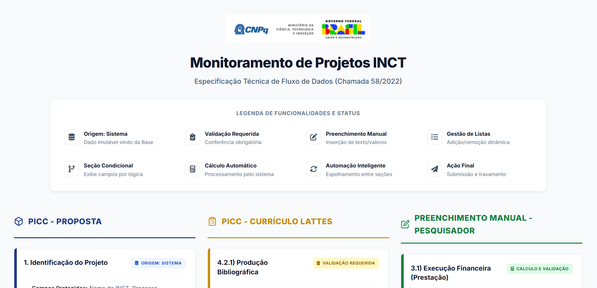
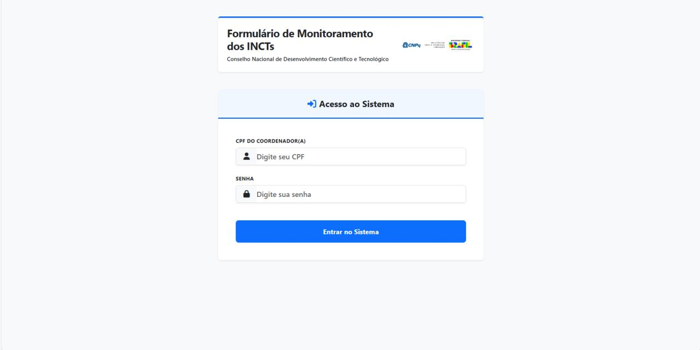
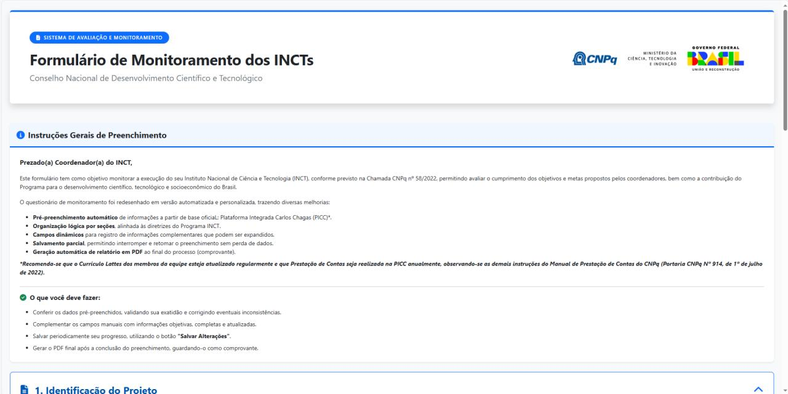

# 🏛️ Engenharia de Software & RPA - Estágio CNPq (2025-2026)

Este repositório centraliza as soluções tecnológicas que desenvolvi durante meu ciclo de um ano como Estagiário de Engenharia de Software no **Conselho Nacional de Desenvolvimento Científico e Tecnológico (CNPq)**.

Os projetos abrangem desde o desenvolvimento de aplicações Full-Stack até a criação de robôs de automação (RPA) para extração e tratamento de dados científicos em larga escala.

---

## 📂 Estrutura dos Projetos

### 🌐 Aplicações Web & Dashboards
* **[cnpq_formulario](./cnpq_formulario):** Sistema Full-Stack para gestão de formulários internos. Inclui autenticação segura, persistência em SQLite (SQLAlchemy) e geração dinâmica de relatórios técnicos em PDF via WeasyPrint.
* **[Dashboard_Base de Dados](./Dashboard_Base_de_Dados):** Interface visual para monitoramento e fluxo de dados dos formulários, utilizando bibliotecas JS para visualização de redes e mapas de dados.

### 🤖 Automação RPA (Web Scraping & Crawler)
* **[Robô Inteligente DGP](./Robô%20inteligente%20DGP):** Minha automação mais completa para o Diretório de Grupos de Pesquisa. Possui interface gráfica (`app_tela.py`) e lógica avançada para extração de dados.
* **[Extrator Lattes](./Extrator_Lattes):** Conjunto de scripts para baixar XMLs, alinhar produções e formatar visualmente dados da Plataforma Lattes.
* **[Robô DGP](./Robô%20DGP):** Ferramenta focada em extração de tabelas e textos específicos de currículos e grupos de pesquisa.
* **[Robô Nova Chamada](./Robô%20Nova%20Chamada):** Automação para diagnóstico e suporte ao lançamento de novas chamadas públicas.

### 📊 Engenharia e Processamento de Dados
* **[Formatação Dados - CONSCIENTIZA](./Formatação%20Dados%20-%20CONSCIENTIZA):** Pipeline de dados para pivotar e processar grandes volumes de planilhas de treinamentos.
* **[Processamento de Feedbacks](./Processamento%20de%20Feedbacks):** Scripts para consolidar feedbacks e gerar insights sobre os processos da casa.
* **[Extração Resumo - Propostas 2008-2014](./Extração%20Resumo%20-%20Propostas%202008-2014):** Script focado na recuperação histórica de resumos de propostas do INCT.

---

### 📸 Demonstração das Interfaces

Aqui estão alguns registros das soluções em funcionamento:

| Dashboard de Inteligência | Tela de Login | Sistema Interno |
|:---:|:---:|:---:|
|  |  |  |

> *Nota: As interfaces foram projetadas para oferecer uma experiência intuitiva, transformando dados complexos em indicadores visuais para tomada de decisão.*

## 🛠️ Competências Desenvolvidas
- **Linguagens:** Python (Back-end), HTML5, CSS3, JavaScript (Front-end).
- **Frameworks:** Flask, SQLAlchemy, Jinja2.
- **Automação:** Selenium, Playwright, RPA Python.
- **Dados:** Pandas, NumPy, Processamento de XML/JSON, Conformidade com **LGPD**.
- **DevOps:** Git/GitHub, Gerenciamento de Ambientes Virtuais.

---

## 🚀 Como explorar
Cada pasta possui seu próprio arquivo de código e, em alguns casos, documentação específica. Para rodar qualquer automação, certifique-se de ter o Python 3.12+ instalado e as dependências do arquivo `requirements.txt` da raiz.

---
**Contato:** [Brahyan Luccas](https://www.linkedin.com/in/brahyan-luccas)